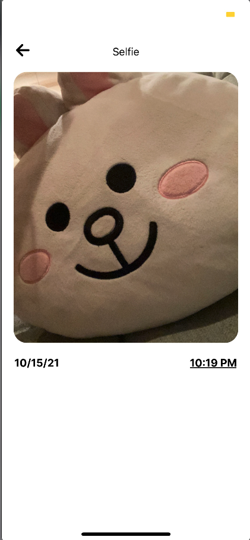

# Selfie





# About this app

- Created with JavaScript, React Native, and React with a couple of libraries for testing, fonts, react router, AsyncStorage, etc.
- On the home page, you can see all of your selfies with a camera icon to take more selfies
- Click on a selfie to view selfie details (ex. date and time)
- Click on camera on the home page to take more selfies with only a front facing camera

# Setup

This app uses react-native and expo. Expo takes a while to download. 

1. Clone the repo
```
git clone https://github.com/jenyang929/Selfie.git
cd Selfie
```

2. Yarn or npm i to install dependencies
```
yarn
```

```
npm i
```

3. To start the app ... 
```
npm start OR yarn start
```

4. If you don't have expo, you will have to download expo globally which is an iOS simulator. You can also download it onto your phone to use your phone as an emulator. Expo CLI requires node versions of these and above:
```
expo-cli supports following Node.js versions:
* >=12.13.0 <13.0.0 (Maintenance LTS)
* >=14.0.0 <15.0.0 (Active LTS)
* >=15.0.0 <17.0.0 (Current Release)
```

# Things to improve

There are always things to help improve the app for the future! Some of the examples are:

1. Tests - more tests the better!
2. CSS - make universal/utility classes to make CSS more readable and reuseable
3. Styling - Use CSS preprocessor and/or design UI libraries to help with styling

...and many more!!

# Boilerplate

Great thanks to this <a href="https://github.com/expo/create-react-native-app">boilerplate!</a>

- Learn more about [Expo Camera](https://docs.expo.dev/versions/latest/sdk/camera).
